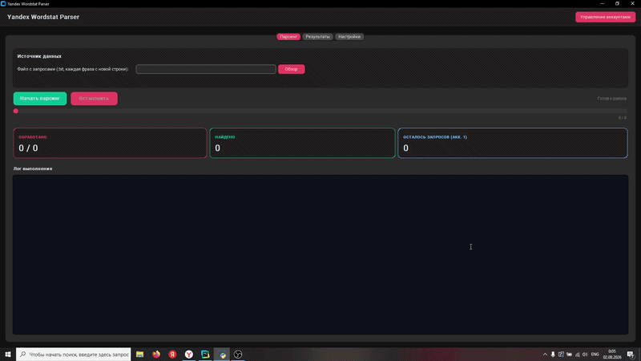

# Yandex Wordstat Parser

[](https://www.python.org/)
[](LICENSE)
[](https://aistudio.yandex.ru/platform/folders)
[](https://github.com/TomSchimansky/CustomTkinter)

Desktop application for mass parsing search queries via the Yandex Wordstat API. Built with Python using CustomTkinter. Supports multiple accounts, automatic rate-limit management (HTTP 429), threshold filtering, and exporting results to Excel.



## Installation

### Prerequisites
- Python 3.11 or higher
- `pip` package manager
- API Key and Folder ID from [Yandex Cloud](https://yandex.ru/dev/wordstat/)

### Steps

1. **Clone the repository**
   ```bash
   git clone https://github.com/yourusername/wordstat-parser.git
   cd wordstat-parser
   ```
1. **Install the package in editable mode**
   ```bash
      pip install -e .
      pip install -e ".[dev]"
   ```

### Usage
Launch the app from anywhere in your terminal:
   ```bash
      wordstat_parser
   ```
Or run as a module:
   ```bash
      python main.py
   ```

### Running Tests
```bash
   pytest tests/
```

### Project Structure

```bash
wordstat_parser/
├── src/wordstat_parser/          # Main package
│   ├── __init__.py
│   ├── __main__.py               # Entry point for `python -m ...`
│   ├── ui.py                     # UI layer (CustomTkinter GUI)
│   ├── client.py                 # Yandex Wordstat API client + account management
│   ├── processor.py              # Background query processing and business logic
│   ├── exporter.py               # Results export to Excel (.xlsx)
│   ├── config.py                 # Configuration manager and global settings
│   └── models.py                 # Dataclass models (accounts, results, settings)
├── tests/                        # Unit tests
├── images/                       # App assets (screenshots, icons)
│   └── demo.gif
├── requirements.txt              # Project dependencies
├── config.json                   # Local settings and accounts (auto-generated)
├── block_history.json            # API temporary block history (auto-generated)
└── README.md
```
